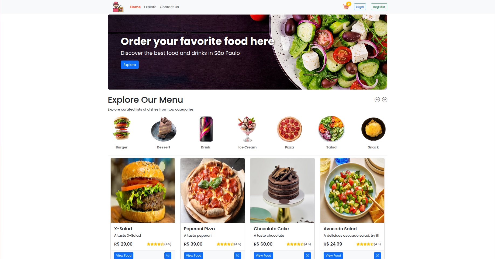
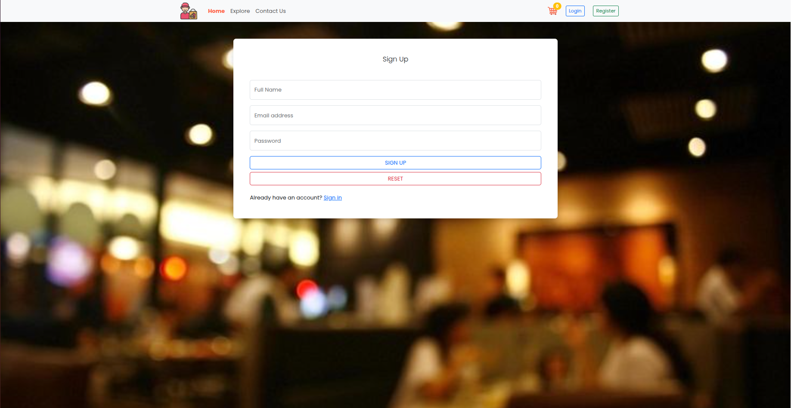
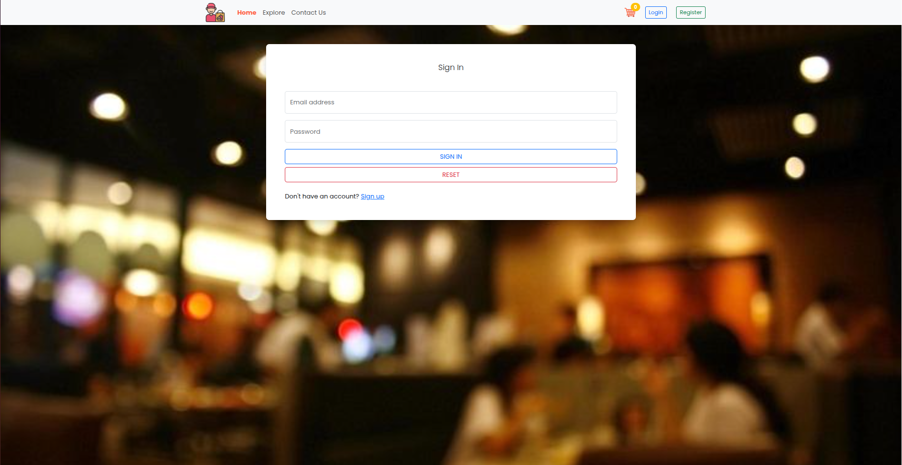
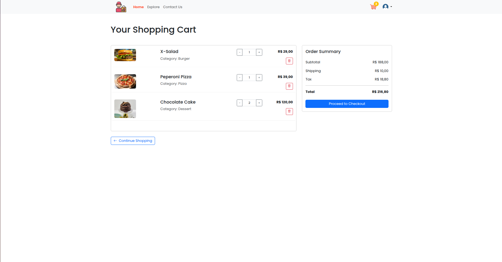
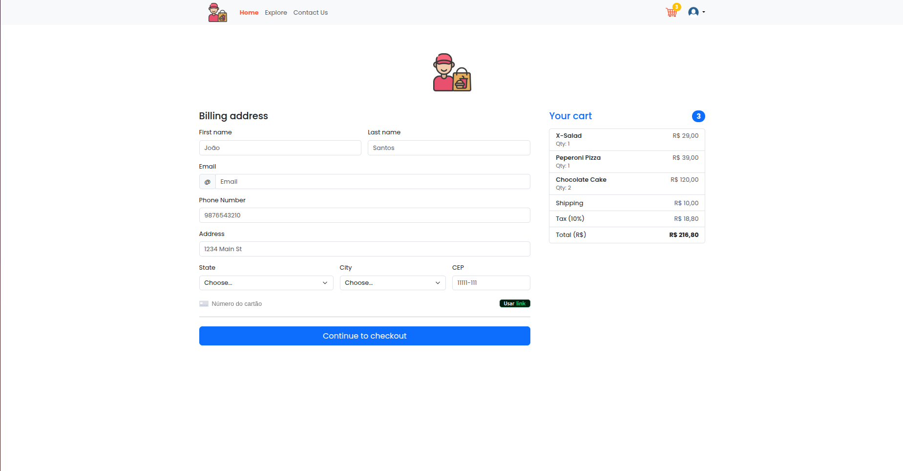

# Foodies - Food Delivery Application

Aplicação fullstack de food delivery com carrinho de compras e gerenciamento de usuários, desenvolvida com **Spring Boot 3** e **React.js**, seguindo boas práticas de arquitetura, testes e CI/CD.

## 📸 Galeria do Projeto

### Home
Home padrão da aplicação, contendo filtros de produtos (imagens redondas que ao clicar, filtram pela categoria). E comidas cadastradas na dashboard, que podem ser adicionadas ao carrinho pelo cliente.


### Registro
Tela para o usuário se registrar.


### Login
Tela de login.


### Carrinho
Carrinho de compra do usuário, onde mostra os pedidos selecionados.


### Checkout
Checkout para o usuário inserir as informações da entrega e o cartão de crédito para a compra definitiva.


---

## ✨ Principais funcionalidades

### 👥 Para clientes
- **Filtro:** Em Home, ao clicar na principais imagens, filtra os produtos pela categoria;
- **Registro e Login:** Registro e login de clientes por meio de suas respectivas telas, autenticação via JWT Token;
- **Carrinho:** Carrinho de compras para o cliente ver seus produtos selecionados, valores e edição do pedido;
- **Checkout:** Checkout para o cliente inserir informações do endereço e cartão para entrega do pedido, sendo validado pela solução Stripe;
- **Feedback:** Notificações visuais de sucesso (Toasts);
- **Pedidos:** Possibilidade de ver seus pedidos e situação do pedido.

### 🔒 Dashboard
- **Pedidos:** Possibilidade ver todos os pedidos feitos e a situação deles;
- **Listagem de produtos:** Visualização de todos os produtos cadastrados, e a possibilidade de edição deles;
- **Criação de produtos:** Criação de produtos para ser entregues, aparecendo para os clientes após a sua criação.

---

## 🛠️ Tecnologias Utilizadas

- **Java 21**
- **Spring Boot 3**
  - Spring Web
  - Spring Security
  - Spring Data MongoDB
- **MongoDB**
- **JWT** para autenticação
- **AWS S3** (armazenamento de imagens)
- **Stripe** (pagamentos)
- **JUnit 5 & Mockito** (testes)
- **Maven**
- **GitHub Actions** (CI)
- **React.js** (frontend framework)
- **Axios** (consumo de API)

---

## 🧱 Arquitetura

O projeto segue uma arquitetura em camadas: Controller → Service → Repository → Database

Principais conceitos aplicados:
- Separação de responsabilidades
- DTOs para entrada e saída
- Mapper dedicado
- Services testáveis com Mockito
- Configurações externas por profile (`dev`, `test`, `prod`)
  
---

## 🔐 Autenticação

A autenticação é feita via **JWT**:

- Login gera um token JWT
- Rotas protegidas exigem o token no header:
```
Authorization: Bearer <token>
```

---

## 🧪 Testes

- Testes unitários com **JUnit 5**;
- Mocks com **Mockito**
- Isolamento de integrações externas
- Profile de testes decicado: spring.profiles.active=test

---

## 🤖 CI/CD

O projeto possui **CI automático com GitHub Actions**
- Executa em:
  - Push para main e develop
  - pull request
- Etapas:
  - Checkout do código
  - Cache do Maven
  - Setup do Java 21
  - Build + testes (mvn clean verify)

---
 
## 👨‍💻 Autor
### Murillo Nonato
Desenvolvedor Fullstack Java

Projeto pessoal para estudo e portfólio
